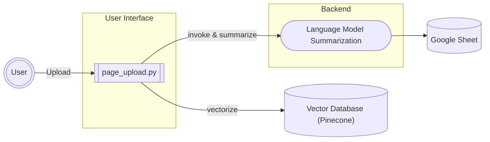
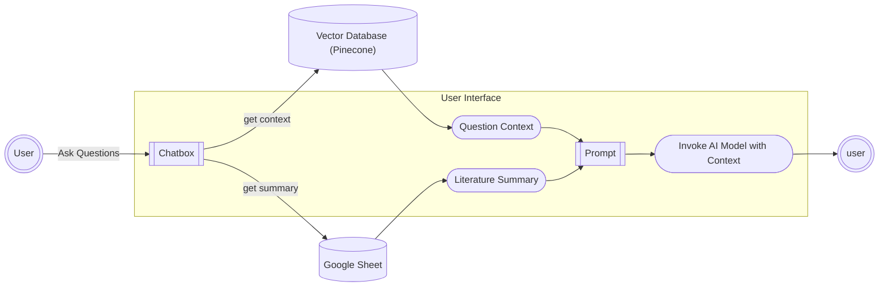

<!-- HEADER STYLE: CLASSIC -->

# EASYESSAY

<em>A RAG-based Literature Information System.</em>

<!-- BADGES -->

<!-- default option, no dependency badges. -->

<!-- default option, no dependency badges. -->

 

## Overview

**Why EasyEssay?**

This project transforms the literature review process by making academic research more accessible and interactive. The core features include:

> - **📚 Streamlined Literature Review:** Accelerate your research process with organized literature management by tags and languages, making it easier to navigate and synthesize multiple sources.
> - **🤖 RAG-Powered Interactive Literature Chat:** Engage directly with your literature through an intelligent chat interface. Ask questions, extract insights, and explore concepts within your documents using advanced RAG (Retrieval-Augmented Generation) technology that prevents AI hallucination.
> - **⚡ Flexible AI Model Selection:** Choose from two AI models (llama-3.3-70b and gpt-oss-120b) based on your needs.
> - **👤 Personalized Research Environment:** Maintain your own secure account with personalized literature collections and chat histories.

**Transform your literature review from a tedious process into an interactive, AI-enhanced research experience that helps you understand and synthesize academic content more effectively.**

---
## Technology
| Aspect | Technology |
| --- | --- |
| Frontend | [Streamlit](https://streamlit.io/) |
| Backend | [Render](https://render.com/) |
| Vector Database | [Pinecone](https://www.pinecone.io/) | 
| Database | Google Sheets|
| LLM Provider | [Cerebras](https://cloud.cerebras.ai/) |
| Model | Llama-3.3-70b / GPT-OSS-120b |

---

## Architecture

### Literature Upload

### Chat with Literature

